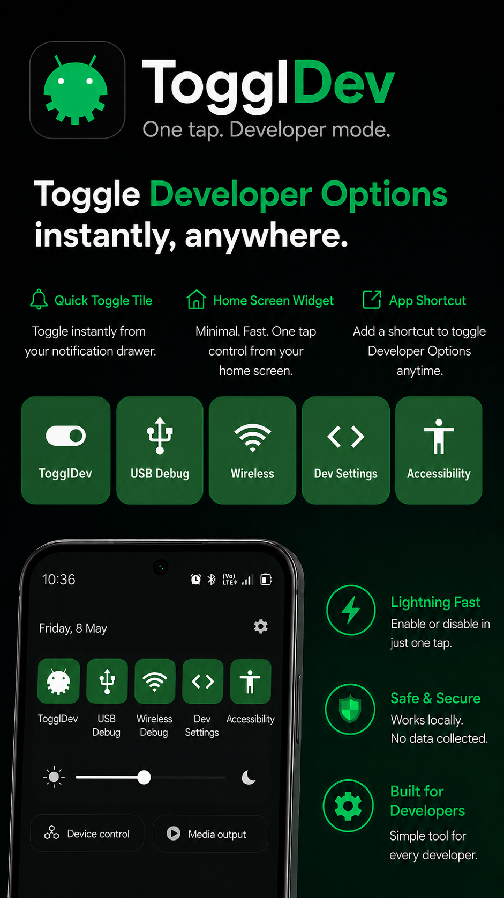
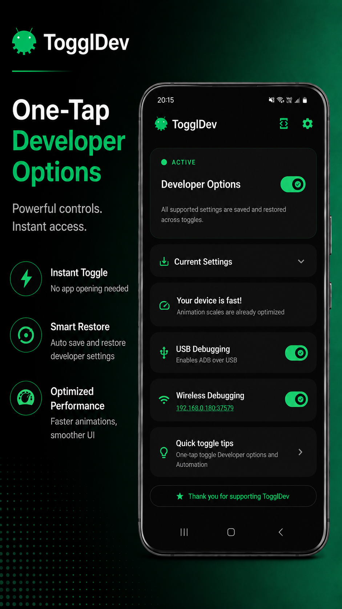

<h1 align="center">TogglDev — One Tap. Developer Mode.</h1>

<p align="center">
  Toggle Android Developer Options on and off instantly — via widget, tile, or shortcut.<br>
  Your settings are automatically saved and restored. No root required.
</p>

<p align="center">
  <a href="https://github.com/dpkay-io/toggldev/releases"></a>
  &nbsp;
  <a href="https://github.com/dpkay-io/toggldev/stargazers"></a>
  &nbsp;
  <a href="https://github.com/dpkay-io/toggldev"></a>
</p>

<p align="center">
  <a href="https://github.com/dpkay-io/toggldev/releases/latest"></a>
  &nbsp;&nbsp;
  <a href="https://play.google.com/store/apps/details?id=com.dpkay.apps.developer_options_toggler"></a>
</p>

---

## The Problem

You enable Developer Options for faster animations, USB debugging, and app testing. Then your **banking app detects it and locks you out**. So you disable everything, use the bank, re-enable, and reconfigure every setting. Again and again.

**TogglDev ends this cycle.** One tap off, one tap back on — every setting automatically saved and restored.

---

## Snapshots

<p align="center">
  
  &nbsp;&nbsp;&nbsp;
  
</p>

---

## Features

### One-Tap Toggles
- **Developer Options** — master on/off with settings snapshot & restore
- **USB Debugging** (ADB)
- **Wireless Debugging** (ADB over WiFi) — shows IP:Port, tap to copy
- **Animation Scales** — window, transition, animator duration (0x–2x)
- **Show Touches**, **Stay Awake While Plugged In**, **Force RTL Layout**, **Don't Keep Activities**, **Wait for Debugger**
- **Modify all supported settings inline** — change values directly from within the app

### Toggle From Anywhere

| Method | What You Get |
|--------|-------------|
| **Quick Settings Tiles** | 5 tiles in your notification shade — swipe down, tap, done |
| **Home Screen Widgets** | 5 widgets with real-time on/off status |
| **App Shortcuts** | Long-press icon → Turn On / Turn Off / Toggle / Dev Settings |
| **Automation** | Tasker, IFTTT, MacroDroid — control via intents |

### Command Automation
Define custom ADB/shell commands, run them on demand from within the app, and view execution logs with full output capture. Includes timeout support, confirmation dialogs, and localized UI across all 18 languages.

### Banking App Shield
Automatically turn off Developer Options when specific apps launch. Configurable delay before re-enabling.

### Smart Snapshot & Restore
When you disable Developer Options, TogglDev saves every setting. When you re-enable, everything is restored exactly as it was.

### Themes
Choose your preferred app theme to match your style or system settings.

### Multi-Language
Supports 18 languages: Arabic, Chinese, Danish, Dutch, English, French, German, Greek, Indonesian, Japanese, Korean, Persian, Polish, Portuguese (BR), Russian, Spanish, Thai, and Turkish.

---

## Privacy & Trust

| | |
|---|---|
| **100% Private** | No personal data collected. Everything stays on your device. |
| **100% Ad-Free** | No ads. Ever. |
| **No Tracking** | No analytics. No monitoring. Period. |
| **Works Offline** | No internet required. Works completely offline. |
| **Safe & Verified** | Google Play Protect verified. Open APK on GitHub. |

---

## Specs

| | |
|---|---|
| **Size** | ~2.4 MB |
| **Languages** | 18 |
| **Android** | 8.0+ (Oreo) |
| **GMS** | Not required — works on any Android device |

---

## Install

### Google Play (Recommended)

<a href="https://play.google.com/store/apps/details?id=com.dpkay.apps.developer_options_toggler"></a>

### APK from GitHub

1. Download **[TogglDev.apk](https://github.com/dpkay-io/toggldev/releases/latest)** from the latest release
2. Transfer to your device or download directly on it
3. Tap the APK and follow install prompts (enable "Install from unknown sources" if prompted)
4. Open the app and follow the onboarding setup

### Required Permission

TogglDev needs `WRITE_SECURE_SETTINGS` to toggle developer options. One-time ADB command:

```
adb shell pm grant com.dpkay.apps.developer_options_toggler android.permission.WRITE_SECURE_SETTINGS
```

The app's onboarding screen walks you through this.

---

## Featured In

- [**HowToMen**](https://youtu.be/2QBFRcqee7I?t=622) — Top 15 Best Android Apps, July 2026
- [**ODORIZZI**](https://youtu.be/RaAqTCALHpU) — Nunca mais desligue o MODO DESENVOLVEDOR no Android

---

## Links

- [Website](https://dpkay.com/toggldev)
- [Google Play Store](https://play.google.com/store/apps/details?id=com.dpkay.apps.developer_options_toggler)
- [Privacy Policy](https://dpkay.com/toggldev/privacy-policy.html)
---
