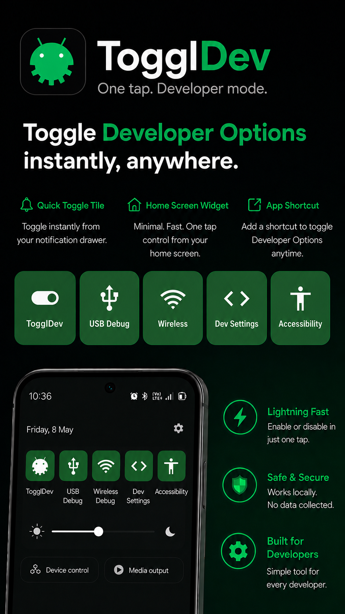
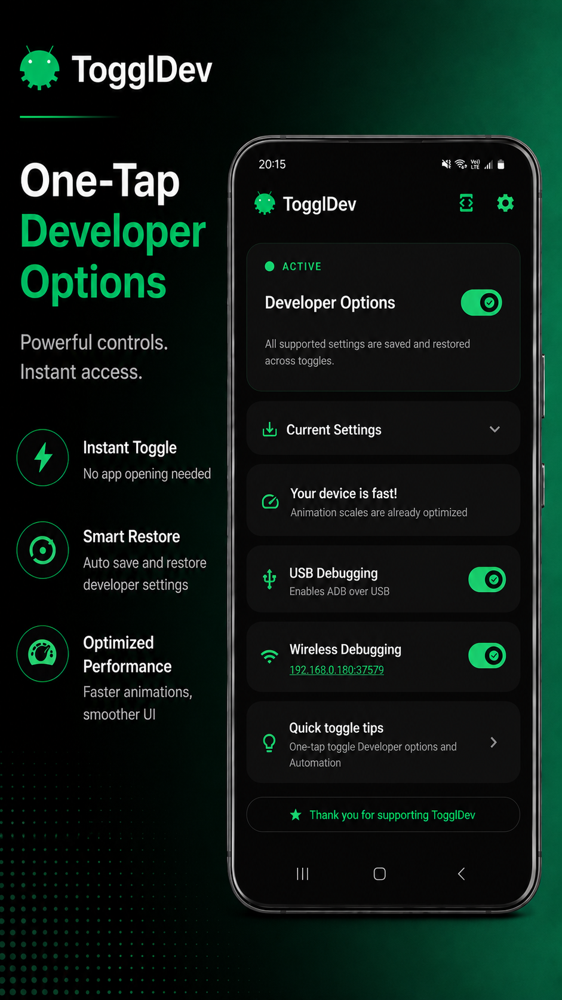

<h1 align="center">TogglDev — One Tap. Developer Mode.</h1>

<p align="center">
  Toggle Android Developer Options on and off instantly — via widget, tile, shortcut, or remotely from your desktop.<br>
  Your settings are automatically saved and restored. No root required.
</p>

<p align="center">
  <a href="https://github.com/dpkay-io/toggldev/releases"></a>
  &nbsp;
  <a href="https://github.com/dpkay-io/toggldev/stargazers"></a>
  &nbsp;
  <a href="https://github.com/dpkay-io/toggldev"></a>
</p>

<p align="center">
  <a href="https://github.com/dpkay-io/toggldev/releases/latest"></a>
  &nbsp;&nbsp;
  <a href="https://play.google.com/store/apps/details?id=com.dpkay.apps.developer_options_toggler"></a>
</p>

---

## The Problem

You enable Developer Options for faster animations, USB debugging, and app testing. Then your **banking app detects it and locks you out**. So you disable everything, use the bank, re-enable, and reconfigure every setting. Again and again.

**TogglDev ends this cycle.** One tap off, one tap back on — every setting automatically saved and restored.

---

## Snapshots

<p align="center">
  
  &nbsp;&nbsp;&nbsp;
  
</p>

---

## Features

### One-Tap Toggles
- **Developer Options** — master on/off with settings snapshot & restore
- **USB Debugging** (ADB)
- **Wireless Debugging** (ADB over WiFi) — shows IP:Port, tap to copy
- **Animation Scales** — window, transition, animator duration (0x–2x)
- **Show Touches**, **Pointer Location**, **Show Layout Bounds**
- **Stay Awake While Plugged In**, **Force RTL Layout**, **Don't Keep Activities**, **Wait for Debugger**
- **Wi-Fi Scan Throttling**, **Bluetooth Disable Absolute Volume**, **Mobile Data Always On**, **Freeform Windows**
- **Modify all supported settings inline** — change values directly from within the app

### Toggle From Anywhere

| Method | What You Get |
|--------|-------------|
| **Quick Settings Tiles** | 6 tiles in your notification shade — swipe down, tap, done |
| **Home Screen Widgets** | 9 widgets with real-time status — including Safe Apps, Action, and Remote Access |
| **App Shortcuts** | Long-press icon → Turn On / Turn Off / Toggle / Dev Settings / Safe Apps |
| **Automation** | Tasker, IFTTT, MacroDroid — control via intents |

**Widgets:** Developer Options · Developer Options & Accessibility · USB Debugging · Wireless Debugging · Dev Settings · Accessibility · Safe Apps · Action · Remote Access

The **Action** widget pins any single App Rule or saved command to your home screen — you pick which one when you place it.

### Safe Apps
A shortcut row for every app you have added to Auto Turn Off, plus every app covered by an enabled App Rule. Tapping an app **applies its rule first, then opens the app** — so banking, payment, and DRM apps that refuse to run while debugging is on start cleanly every time.

- **Long-press to pin** any safe app to your home screen — the pinned shortcut applies the rule then launches, without opening TogglDev
- Reachable without opening the app at all — long-press the TogglDev icon, or add the **Safe Apps widget** — both open a floating drawer
- Any launcher offering Android's standard shortcut picker lists TogglDev as **"Launch a safe app"**, so the toggle is guaranteed even when the launch comes from outside TogglDev
- The row fills itself — add an app to Auto Turn Off or enable an App Rule and it appears automatically

### Toggle Zone
Decide exactly which settings the master switch is allowed to touch. Tap the wrench icon next to **Developer Options**, then tick everything TogglDev may change — anything left unticked is never touched.

Your choice applies to the master switch, Quick Settings tiles, widgets, Auto Turn Off, and Turn Off / Turn On app rules. Custom rules always use the settings picked inside the rule itself.

> Leaving USB or wireless debugging outside the zone means they stay on after everything else goes off — and banking or payment apps can spot that and still refuse to run.

### Remote Access
Control your device's developer settings from your desktop — no cable needed. TogglDev runs a lightweight HTTP server on your phone with secure pairing (6-digit code + token auth). Toggle any setting, check status, or grab wireless debug info from your computer.

- **Companion app:** [TogglDev Remote](https://github.com/dpkay-io/toggldev-remote) — a desktop client for seamless remote control
- **Home screen widget** shows server status, IP:port, and pairing code at a glance
- **Free tier:** 10 minutes/day — unlimited for Gourmet supporters

### Command Automation
Define custom ADB/shell commands that run automatically when you toggle Developer Options, USB Debugging, or WiFi Debugging on/off. Separate commands for each trigger event, execution logs with timestamps and exit codes, and automatic privilege detection (base, ADB-elevated, or root).

### App Rules
Create rules that apply settings to groups of apps. Force-enable, force-disable, or run custom actions when specific apps launch, and restore the original state after a configurable delay. Conflict detection warns if multiple rules target the same app.

Unlike Auto Turn Off (a single global list), App Rules let you create multiple independent rules with different behavior per app group.

### Auto Turn Off
Automatically turn off Developer Options when banking or payment apps launch, and turn them back on after you leave. Pick which apps trigger the switch and choose a re-enable delay — **1 second to 5 minutes, or never**. Uses an accessibility service that only reads the foreground app name — nothing else.

Two extras live on the same screen:

- **Accessibility Hide** — some apps crash or refuse to start when they detect a running accessibility service. This hides TogglDev from the apps you choose, only while they are open, then silently restores everything when you leave. Works per-app and integrates with App Rules. Requires Usage Access permission.
- **Ask to Close** — when you leave one of these apps, TogglDev asks whether to close it and clear it from Recents, so it cannot come back before Developer Options are restored.

### Smart Snapshot & Restore
When you disable Developer Options, TogglDev saves every setting. When you re-enable, everything is restored exactly as it was. A lifetime toggle counter tracks how many times you have done it — and how much time that saved you.

### Staying Reliable
Android pauses background apps aggressively. Three switches in Settings keep TogglDev dependable:

- **Unrestricted Battery** — excludes TogglDev from battery optimization so it keeps running. Recommended if you use Auto Turn Off or App Rules.
- **Keep Alive** — a small ongoing notification keeps TogglDev awake, so widgets and tiles always match the real setting.
- **Restore Prompt** — after TogglDev switches Developer Options off, a notification offers one-tap Restore to bring your settings back and clear safe apps from Recents.

If the accessibility service ever gets switched off, TogglDev **warns you with a notification** — without it, Auto Turn Off and App Rules quietly stop working and nothing else would tell you.

**Diagnostic Logs** (Settings) keep the last 7 days of toggle events, shareable when reporting a problem — events and timings only, no personal data.

### Themes
Choose your preferred app theme to match your style or system settings.

### Multi-Language
Supports 18 languages: Arabic, Chinese, Danish, Dutch, English, French, German, Greek, Indonesian, Japanese, Korean, Persian, Polish, Portuguese (BR), Russian, Spanish, Thai, and Turkish.

---

## Privacy & Trust

| | |
|---|---|
| **100% Private** | No personal data collected. Everything stays on your device. |
| **100% Ad-Free** | No ads. Ever. |
| **No Tracking** | No analytics. No monitoring. Period. |
| **Works Offline** | No internet required. Works completely offline. |
| **Safe & Verified** | Google Play Protect verified. Open APK on GitHub. |

---

## Specs

| | |
|---|---|
| **Size** | ~3.1 MB |
| **Languages** | 18 |
| **Android** | 8.0+ (Oreo) |
| **GMS** | Not required — works on any Android device |

---

## Install

### Google Play (Recommended)

<a href="https://play.google.com/store/apps/details?id=com.dpkay.apps.developer_options_toggler"></a>

### APK from GitHub

1. Download **[TogglDev.apk](https://github.com/dpkay-io/toggldev/releases/latest)** from the latest release
2. Transfer to your device or download directly on it
3. Tap the APK and follow install prompts (enable "Install from unknown sources" if prompted)
4. Open the app and follow the onboarding setup

### Required Permission

TogglDev needs `WRITE_SECURE_SETTINGS` to toggle developer options. One-time ADB command:

```
adb shell pm grant com.dpkay.apps.developer_options_toggler android.permission.WRITE_SECURE_SETTINGS
```

The app's onboarding screen walks you through this.

> **Note for OnePlus/Xiaomi users:** You might have to **Disable Permission Monitoring** or **Disable System Optimization** in your developer options for the ADB command to work.

---

## Roadmap

- [x] Theme support
- [x] One tap Wireless debugging widget
- [x] App rules to customize individual developer setting toggle for app launch
- [x] Command automation to run any shell commands on toggle of Developer options and Debugging
- [x] Remote access and MCP to seamlessly control Developer options for Agentic development with Claude, Gemini and others
- [ ] Shizuku integrations
- [x] Accessibility Hide — auto-disable accessibility services for targeted apps
- [x] Safe Apps — launch protected apps with their rule already applied
- [x] Toggle Zone — choose exactly which settings the master toggle may change
- [ ] Remove Accessibility Services dependency
- [ ] Master widget to support more toggles
- [ ] App commands automation

---

## Featured In

- [**HowToMen**](https://youtu.be/2QBFRcqee7I?t=622) — Top 15 Best Android Apps, July 2026
- [**ODORIZZI**](https://youtu.be/RaAqTCALHpU) — Nunca mais desligue o MODO DESENVOLVEDOR no Android
- [**Trakin Tech Tamil**](https://youtu.be/1RoaZy-zVHA?si=A7Nj5sonPxcDfzNj&t=134) — Best New Free Android Apps

---

## Links

- [Website](https://dpkay.com/toggldev)
- [Google Play Store](https://play.google.com/store/apps/details?id=com.dpkay.apps.developer_options_toggler)
- [TogglDev Remote (Companion App)](https://github.com/dpkay-io/toggldev-remote)
- [Privacy Policy](https://dpkay.com/toggldev/privacy-policy.html)
---
